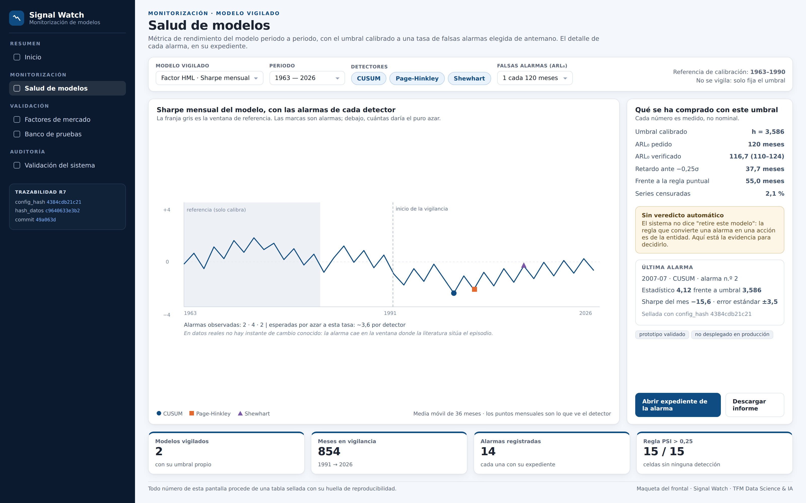
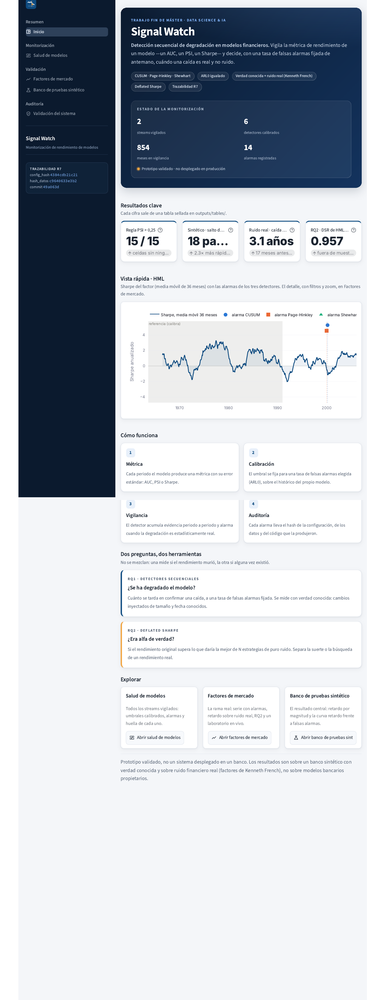
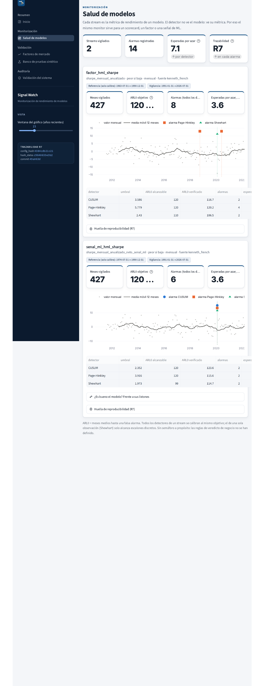
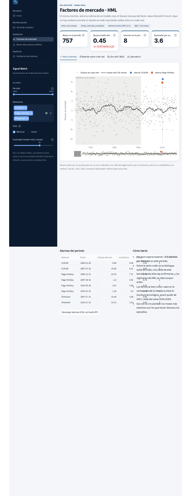
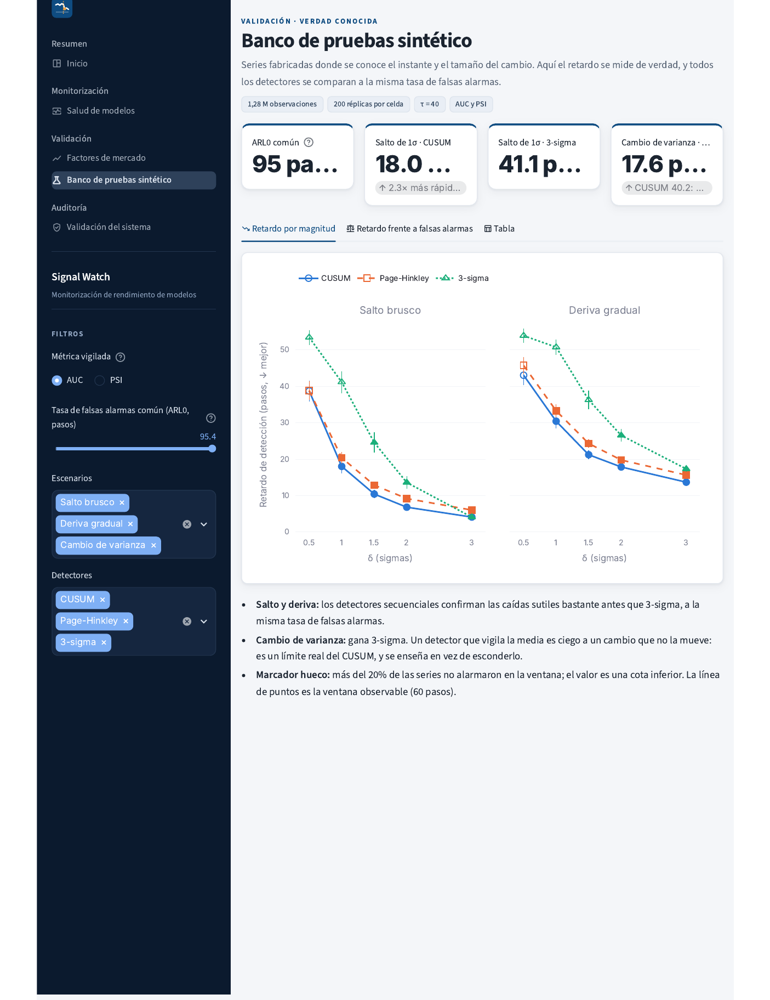
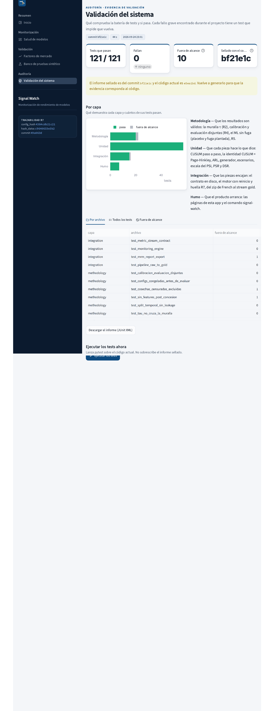

# Entrega 5 — Diseño del frontal y experiencia de usuario del producto

> **Proyecto: Signal Watch** — Detección secuencial de la degradación del rendimiento en modelos financieros.

---

## 0. Qué he cambiado respecto a lo que prometí, y por qué

El enunciado dice que el frontal no hace falta que esté implementado. El mío **sí lo está**, así que esta entrega lleva las dos cosas: la maqueta del frontal y las capturas de la aplicación real funcionando sobre mis resultados sellados. Lo digo al principio para que se lea con esa clave, y porque las diferencias entre una y otra son parte de lo que cuento.

Y precisamente porque está construido, hay tres cosas que prometí en la Entrega 2 y que **no están como las describí**. Las pongo aquí y no las escondo, ya que si alguien compara esta entrega con aquella las va a encontrar, y porque en dos de los tres casos el motivo es una decisión de diseño que defiendo, no una renuncia por falta de tiempo.

**1. No hay veredicto de salud en semáforo, y es a propósito.** En la Entrega 2 escribí que el panel mostraría _"un veredicto de salud del modelo explicado en lenguaje claro"_. Al construirlo me di cuenta de que no puedo hacerlo con honestidad: **la regla que convierte una alarma en una acción es del banco, no mía**. Decir "rojo" significa "retire este modelo", y yo no tengo forma de justificar ese umbral de negocio con nada de lo que he medido. Un semáforo inventado sería decir bastante más de lo que sé, y además es justo el tipo de simplificación que hace que un analista deje de mirar el detalle. Con lo cual el panel enseña **evidencia**, no veredicto. Lo desarrollo en 3.1.

**2. El informe MRM está a medias, y el registro de auditoría encadenado por _hashes_ queda en el roadmap.** En la Entrega 2 prometí _"exportación de un informe estilo MRM con registro de auditoría"_ y en la Entrega 3 describí un log encadenado por _hashes_. Lo que hay construido es la parte que me pareció más defendible con el tiempo que tenía: **cada alarma lleva su expediente completo** (configuración, datos y versión del código con los que se produjo), y el panel tiene una página de **validación del sistema** con la evidencia de pruebas sellada y descargable. Lo que falta es el expediente maquetado en PDF y el log encadenado. Es una renuncia por calendario y así la cuento.

**3. La simulación de valor económico no está.** También la prometí en la Entrega 2 y tampoco ha entrado, por lo mismo.

**Y dos cosas que no había previsto y que sí están**, porque el balance completo es más justo que solo la lista de lo que falta: un **laboratorio** donde el usuario inyecta una caída y ve reaccionar a los detectores, que ha acabado siendo la parte del panel que mejor explica el producto; y el **descubrimiento automático de los modelos vigilados**, gracias al cual la señal de ML apareció en el panel sin que yo tocara el código de la aplicación.

---

## 1. Resumen de la solución y del usuario

**Qué problema resuelve.** Los bancos tienen que vigilar la degradación de sus modelos en producción y lo hacen con una regla fija heredada —_"si PSI > 0,25, alarma"_— cuya tasa de falsas alarmas nunca ha medido nadie. Signal Watch la sustituye por **detectores secuenciales calibrados**, que acumulan evidencia periodo a periodo y disparan a una tasa de falsas alarmas elegida de antemano y verificada.

**Quién es el usuario.** El **analista de validación de modelos (MRM)** de una entidad financiera, que es a quien apunto desde la Entrega 2. Hay tres cosas suyas que condicionan el diseño entero:

- **Vigila muchos modelos a la vez**, con lo cual necesita empezar por una vista de conjunto y bajar al detalle solo donde haga falta.
- **Su producto final es un expediente, no una impresión.** Tiene que poder justificar por escrito por qué dijo lo que dijo, con la configuración, los datos y la versión del código que lo produjeron.
- **Responde ante un supervisor.** Un número sin su incertidumbre al lado no le ayuda: le crea un problema.

**Qué tarea concreta tiene.** _"¿Este modelo se ha degradado de verdad o lo que veo es ruido? Y si lo escalo, ¿con qué lo justifico?"_

**Qué tipo de producto estoy diseñando.** Un **panel analítico de monitorización con un simulador dentro**, y las dos cosas cuentan. El panel enseña el estado de los modelos vigilados, sus alarmas y la evidencia de cada una. El simulador —el laboratorio— deja al usuario **inyectar una caída del tamaño que quiera sobre ruido real y ver reaccionar a los tres detectores**, que es lo que ningún gráfico estático consigue: entender _qué es capaz de ver el sistema_ antes de fiarse de él. Creo que es la pieza más importante del frontal, aunque es la que menos esperaba tener: salió de querer enseñar el detector funcionando y acabó siendo la mejor respuesta a "¿y esto para qué sirve?".

**Qué obtiene.** Una alarma **con su expediente**: la fecha, la evidencia acumulada frente al umbral, la tasa de falsas alarmas del punto de operación, el retardo esperado según la magnitud del cambio y la huella de reproducibilidad completa. Con eso escala al propietario del modelo, o descarta la alarma dejando constancia.

---

## 2. Imagen del frontal

### 2.1 La maqueta

_Maqueta de la pantalla principal, la de **Salud de modelos**, que es donde ocurre la tarea del usuario. De izquierda a derecha y de arriba abajo: la navegación con los cuatro bloques y la huella de reproducibilidad; las entradas que aporta el usuario (modelo vigilado, periodo, detectores y tasa de falsas alarmas); el resultado, que es la serie de la métrica con la ventana de referencia sombreada y las alarmas de cada detector; el contexto que hace falta para interpretarlo — lo que se ha comprado con ese umbral, el aviso de que no hay veredicto automático y el detalle de la última alarma —; y abajo las dos acciones que puede realizar._

### 2.2 Y lo que acabó construido

Como el frontal está construido, pongo también las capturas de la aplicación funcionando, para que se vea qué parte de la maqueta llegó a existir y con qué aspecto. Lo que falta respecto a lo que prometí en la Entrega 2 está en la sección 0, y lo que es solo diseño, en la 5.2.

_Pantalla de entrada: identidad y alcance del producto, estado de la monitorización, resultados clave con su procedencia y las vías de entrada al detalle._

_Vista de conjunto: una tarjeta por modelo vigilado, con sus umbrales calibrados, sus alarmas y su huella de reproducibilidad._

_Detalle de un modelo: la serie mensual con la ventana de referencia sombreada, las alarmas de cada detector y el número de alarmas que daría el puro azar._

_La evidencia con verdad conocida: retardo según la magnitud del cambio y la curva de retardo frente a falsas alarmas._

_La auditoría: qué comprueba cada capa de pruebas, cuántas pasan, cuáles están declaradas fuera de alcance y con qué versión del código está sellado el informe._

## 3. Justificación del diseño

### 3.1 Utilidad y valor de la solución

El frontal permite decidir si un modelo se ha degradado, con una tasa de falsas alarmas conocida, y producir el expediente que justifica esa decisión.

La decisión que mejora es la de retirar o recalibrar un modelo, que es cara en las dos direcciones: retirar uno sano cuesta un proyecto de remodelización y perder un activo que funcionaba, y no retirar uno degradado cuesta decisiones malas durante meses. Hoy esa decisión se toma mirando una regla cuyo comportamiento nadie ha medido, con lo cual lo que aporta el frontal son los dos números que faltaban: **cuántas falsas alarmas cuesta este punto de operación y cuánto se tarda en confirmar una caída de tamaño X**.

**Qué información es esencial y por tanto está siempre visible:**

| Elemento                                                                      | Por qué es esencial                                                                     |
| ----------------------------------------------------------------------------- | --------------------------------------------------------------------------------------- |
| La serie de la métrica, con la ventana de referencia sombreada                | Sin ver de dónde sale el umbral, la alarma es un oráculo                                |
| Las alarmas de **los tres detectores a la vez**                               | El usuario compara métodos en vez de fiarse de uno a ciegas                             |
| El **número de alarmas esperadas por puro azar**, escrito dentro de la figura | Es lo que impide leer dos alarmas como dos hallazgos                                    |
| El retardo esperado según la magnitud                                         | La ausencia de alarma no es ausencia de problema: puede ser que aún no haya dado tiempo |
| La huella de reproducibilidad                                                 | Sin ella el resultado no entra en un expediente                                         |

Y esto es lo que he decidido no mostrar, que me costó bastante más que decidir lo que sí:

| Lo que omito                                                          | Por qué                                                                                                |
| --------------------------------------------------------------------- | ------------------------------------------------------------------------------------------------------ |
| **El semáforo verde/ámbar/rojo** que prometí en la Entrega 2          | La regla de negocio que convierte una alarma en una acción es del banco. Lo desarrollo en la sección 0 |
| **Una recomendación automática de retirada**                          | Por lo mismo: el sistema aporta evidencia, no decide                                                   |
| **Los parámetros internos de cada detector en la pantalla principal** | Están, pero en la vista de detalle. En portada estorban                                                |
| **Un número único de "salud del modelo"**                             | Comprimirlo todo a un índice destruye justo la información que hace defendible la decisión             |

En cuanto a cómo se convierte el resultado analítico en una acción: la alarma llega con su expediente y lo que habilita el frontal es escalar con evidencia. No es una acción espectacular, pero es la que existe de verdad — el analista no aprieta un botón que retira un modelo, escribe una opinión que alguien tiene que poder revisar.

### 3.2 Flujo de usuario

**Punto de entrada.** La portada contesta cuatro preguntas antes de que el usuario las haga: qué es esto, cuál es su alcance (_"Prototipo validado · no desplegado en producción"_, visible y no escondido en un pie), qué se está vigilando ahora mismo (modelos, detectores calibrados, meses bajo vigilancia y alarmas registradas) y qué ha demostrado (cuatro resultados clave, cada uno diciendo de qué tabla sale).

**El recorrido principal:**

1. **Entra y ve el estado.** Los cuatro indicadores y una vista rápida de la serie principal con sus alarmas.
2. **Va a _Salud de modelos_** y ve todos los modelos vigilados, cada uno con su umbral calibrado, su tasa de falsas alarmas verificada y sus alarmas. Aquí decide en cuál entrar.
3. **Entra en un modelo** y **aporta sus selecciones**: periodo, qué detectores comparar, vista mensual o anualizada, suavizado. Son los filtros de un analista y no adornos, ya que recortar al periodo de interés y quitar detectores de la vista es lo que hace legible una serie de 757 puntos.
4. **Lee el resultado en cuatro pestañas**, ordenadas de lo descriptivo a lo exploratorio: serie y alarmas · retardo sobre ruido real · ¿era alfa? (RQ2) · laboratorio.
5. **Decide si fiarse**, y aquí está la pieza que distingue a este frontal: en el **laboratorio** inyecta una caída del tamaño que quiera y ve cuánto tarda cada detector en confirmarla sobre ruido real. Puede simular 200 series y ver la distribución completa del retardo, no un caso suelto.
6. **Comprueba el rigor del sistema** en _Validación del sistema_, donde puede además **ejecutar la batería de pruebas en directo** sobre el código actual.
7. **Actúa:** escala con el expediente, o descarta la alarma dejando constancia.

**Qué procesa el sistema por detrás**, aunque no sea visible: calibra el umbral de cada detector por bisección sobre la ventana de referencia hasta alcanzar la tasa de falsas alarmas pedida, verifica la tasa conseguida sobre series distintas de las de calibración, recorre la ventana de vigilancia acumulando evidencia y, tras cada alarma, reinicia el detector y sigue vigilando.

Las excepciones son la parte que más me ha hecho pensar, y la que peor tenía resuelta al principio:

| Situación                                                                    | Qué hace el frontal                                                                                                                                                                              |
| ---------------------------------------------------------------------------- | ------------------------------------------------------------------------------------------------------------------------------------------------------------------------------------------------ |
| No existen los resultados sellados (repositorio recién clonado)              | Lo dice y **enseña el comando exacto** que hay que ejecutar. Ni se rompe ni deja una pantalla vacía                                                                                              |
| El informe de pruebas es de una versión anterior del código                  | **Avisa con las dos versiones a la vista.** Para mí es el aviso más importante del panel, ya que una evidencia desfasada es peor que no tener ninguna: parece que respalda algo que ya no existe |
| Un modelo no tiene tabla de comparación con sus baselines                    | Se omite esa sección para ese modelo y el resto de la ficha funciona                                                                                                                             |
| El usuario cambia los parámetros del laboratorio después de simular          | **El resultado anterior se invalida**, en vez de quedarse en pantalla al lado de unos parámetros que ya no lo produjeron                                                                         |
| Más del 20% de las series quedan censuradas                                  | El punto se dibuja **con marcador hueco**: ese número es una cota inferior y no un retardo medido                                                                                                |
| La tasa de falsas alarmas verificada se aleja más de un 10% de la alcanzable | Se avisa en la ficha del modelo, con el valor alcanzable al lado                                                                                                                                 |

### 3.3 Experiencia de usuario

**Jerarquía visual.** Lo primero que capta la atención es el bloque de identidad con el alcance del producto, lo segundo el estado de la monitorización y lo tercero los resultados clave. La navegación está agrupada en cuatro bloques con nombres de tarea —Resumen, Monitorización, Validación, Auditoría—, no de tecnología.

**Una decisión de navegación que quiero explicar**, porque parece un detalle técnico y es de producto: el menú lo declaro a mano en vez de dejar que la herramienta liste todas las páginas del proyecto. Mi árbol de repositorio reserva hueco para partes que no he construido, con lo cual **así el menú solo enseña lo que existe de verdad**. Y si dejo entradas vacías, lo primero que ve el usuario es una promesa que no puedo cumplir.

**Simplicidad sin ocultar.** Mi regla es que cada pantalla conteste **una** pregunta y esconda el detalle tras una pestaña o un desplegable. La información técnica que el analista necesitará alguna vez pero no siempre —la configuración congelada, los pesos del modelo vigilado, la comparación con los baselines— vive en desplegables etiquetados **con la pregunta que contestan** (_"¿Es bueno el modelo? Frente a sus listones"_) y no con el nombre del fichero que hay detrás.

**Legibilidad y consistencia:**

- **Cada detector tiene siempre el mismo color, el mismo marcador y el mismo trazo** en todas las figuras. Y la codificación no es solo por color, con lo cual la figura **se sigue leyendo impresa en blanco y negro**, que no es un capricho: los expedientes de validación se imprimen.
- **La paleta está validada para visión con deficiencia de color**, con el criterio estricto de comparar todos los pares entre sí. El peor par queda en ΔE 9,2, por encima de su umbral.
- **Las unidades van en las etiquetas**: meses, años, pasos, sigmas. Un retardo sin unidad no se puede interpretar.
- **Las etiquetas no se transforman a mayúsculas.** Suena menor y no lo es: al hacerlo, `σ` se convertía en `Σ`, con lo cual mi interfaz decía _"CAÍDA DE 0,25Σ"_, que es otra cosa. Lo encontré revisando el panel y lo corregí, pero lo cuento porque estuvo ahí bastantes días sin que yo lo viera.

**Contexto y confianza**, que es el eje del diseño entero:

- Cada métrica se enseña **con su error estándar**.
- Las alarmas se enseñan **junto al número esperado por azar**, escrito dentro de la figura.
- La ventana de referencia aparece **sombreada** sobre la serie, con lo cual se ve de dónde sale el umbral y que no calibré con los mismos datos que luego vigilo.
- Cada ficha lleva su **huella de reproducibilidad**, también en la barra lateral.
- **La media móvil de la serie es de 36 meses y no de 12**, y este es mi ejemplo favorito de decisión de diseño que en realidad es estadística: con la desviación que tiene mi serie, una media móvil de 12 meses fluctúa lo bastante por azar como para que sus picos parezcan regímenes que no existen. Es una decisión de dibujo que en realidad es estadística, y me la encontré comparando las dos.

**Control del usuario.** Elige el periodo, los detectores, la vista, el suavizado, la tasa de falsas alarmas común de la comparación, el número de pruebas del _Deflated Sharpe_ y todos los parámetros del laboratorio, y puede ejecutar la batería de pruebas cuando quiera. Lo que **no** puede es cambiar los resultados sellados desde la interfaz, y eso es intencionado: **el panel no calcula resultados, los lee** (sección 4.5).

**Retroalimentación del sistema.** Indicador de progreso mientras se simulan series o se ejecutan las pruebas, con una estimación del tiempo; mensajes de error que dicen **qué comando ejecutar** y no solo que falta algo; y el aviso de desfase entre la evidencia y el código.

**Accesibilidad y dispositivo.** Está pensado para pantalla de escritorio, que es donde trabaja este usuario. La paleta está validada para visión con deficiencia de color, y toda la información codificada por color lo está también por forma o por texto.

---

## 4. Presentación de resultados y explicabilidad

### 4.1 Cuál es el resultado principal

**La alarma**, con sus dos números de contexto: la tasa de falsas alarmas verificada del punto de operación (lo que se ha comprado) y el retardo esperado según la magnitud del cambio.

### 4.2 Qué información adicional permite interpretarlo

| Información                                     | Para qué sirve                                        |
| ----------------------------------------------- | ----------------------------------------------------- |
| Error estándar de cada observación              | Distinguir un movimiento real del ruido de estimación |
| Ventana de referencia marcada sobre la serie    | Ver de dónde sale el umbral                           |
| Alarmas esperadas por azar, dentro de la figura | **Impide leer dos alarmas como dos hallazgos**        |
| Retardo según la magnitud                       | Entender qué **no** puede ver todavía el sistema      |
| Marcador hueco cuando hay censura alta          | Distinguir una cota inferior de una medición          |
| Los tres detectores a la vez                    | Ver si el resultado depende del método elegido        |
| Huella de reproducibilidad                      | Poder rehacer el número                               |

### 4.3 Cómo evito presentar una estimación como una certeza

Son cinco mecanismos y todos están a la vista en la interfaz, no en la documentación:

1. **No hay semáforo ni veredicto automático.**
2. **El alcance del producto está en la portada**: prototipo validado, no desplegado en producción.
3. **El lenguaje de las alarmas sobre datos reales.** Como en datos reales no existe un instante de cambio conocido, la interfaz dice _"la alarma cae en la ventana donde la literatura sitúa este episodio"_ y **nunca** _"el sistema detectó este episodio"_. Y esa frase va **dentro de la propia figura**, no en una nota al pie, porque la nota al pie no se copia cuando alguien pega la imagen en un informe.
4. **El número de alarmas esperadas por azar**, al lado de las observadas.
5. **La censura marcada** en la propia figura.

### 4.4 Qué reservo para la vista de detalle

En la pantalla principal: la serie, las alarmas y los indicadores. En pestañas o desplegables: los umbrales calibrados y su tasa verificada, la configuración congelada, la comparación del modelo vigilado con sus baselines y su significancia, los pesos del modelo y su estabilidad entre épocas, y el informe completo de pruebas.

### 4.5 Una regla de arquitectura que también es de producto

**El panel no calcula resultados.** Todo número que aparece en pantalla sale de una tabla sellada con su huella o de una función del paquete del proyecto. Lo hago porque así el número de la pantalla y el número del informe son el mismo. Un panel que recalcula por su cuenta acaba enseñando antes o después una cifra que no está en ningún expediente.

La única excepción es el **laboratorio**, que sí calcula en vivo, y por eso está etiquetado como laboratorio, separado del resto, y sus resultados se invalidan al cambiar los parámetros.

### 4.6 IA generativa dentro del producto: **no la voy a utilizar**

Lo indico expresamente, como pide el enunciado, y explico el motivo porque el "no" a secas no dice nada. Hablo de la aplicación: de si el panel incorpora o no una capa que resuma o narre los resultados al usuario.

Un panel de validación de modelos tiene que producir **el mismo texto y el mismo número cada vez que se ejecuta sobre los mismos datos**. Un resumen generado introduce variabilidad no trazable justo en la capa que un supervisor va a leer. Y el riesgo concreto es que **narre una causa que mi análisis no ha medido**: decir _"el modelo se ha degradado por el cambio de tipos"_ cuando lo único que sabe el sistema es que la métrica ha bajado. La atribución de causas es precisamente la pregunta que he dejado fuera de alcance (la RQ3 de la Entrega 4), con lo cual una capa generativa estaría rellenando con lenguaje un hueco que mi evidencia no cubre.

En un producto de riesgo de modelo, la trazabilidad y el determinismo valen más que la fluidez del texto. Si en el futuro la incorporase, su función sería **redactar el borrador del expediente a partir de campos ya calculados**, sin inventar causas y sin sustituir a ningún cálculo.

---

## 5. Alcance del MVP

Uso los mismos marcadores de madurez que en la Entrega 3, porque me parece la forma más honesta de contestar a esto:

- 🟢 **Implementado y funcionando.**
- 🟡 **Diseñado, no implementado.**

### 5.1 Lo que está construido

| Parte                                                                             | Estado                                                             |
| --------------------------------------------------------------------------------- | ------------------------------------------------------------------ |
| Portada con estado, resultados clave y alcance del producto                       | 🟢                                                                 |
| Salud de modelos, con **descubrimiento automático** de los modelos vigilados      | 🟢 — al añadir un modelo nuevo aparece **sin tocar la aplicación** |
| Detalle de un modelo: serie con alarmas, filtros y retardo sobre ruido real       | 🟢                                                                 |
| RQ2 con el número de pruebas ajustable y el _Deflated Sharpe_ recalculado en vivo | 🟢                                                                 |
| Laboratorio de inyección, con simulación de 200 series                            | 🟢                                                                 |
| Banco de pruebas: retardo por magnitud y curva de retardo frente a falsas alarmas | 🟢                                                                 |
| Validación del sistema: informe de pruebas sellado y ejecución en directo         | 🟢                                                                 |
| Huella de reproducibilidad en cada vista                                          | 🟢                                                                 |
| Descarga del informe de validación                                                | 🟢                                                                 |

### 5.2 Lo que es solo diseño

| Parte                                             | Por qué                                                                                                                                 |
| ------------------------------------------------- | --------------------------------------------------------------------------------------------------------------------------------------- |
| **Informe MRM completo en PDF**                   | 🟡 La evidencia de validación ya se enseña y se descarga en formato estándar, pero el expediente maquetado no ha entrado por calendario |
| **Registro de auditoría encadenado por _hashes_** | 🟡 Lo diseñé en la Entrega 3 y no lo he construido. Cada alarma sí lleva su huella individual                                           |
| **Vista de valor económico**                      | 🟡 La simulación con costes de transacción no está                                                                                      |
| **Rama de crédito**                               | 🟡 Su ventana válida está decidida con datos reales, pero el _scorecard_ no se construyó                                                |
| **Atribución a nivel de variable**                | 🟡 La pregunta _"¿qué se rompió?"_ queda fuera de alcance                                                                               |

**Ninguna de esas partes aparece en el menú**, por lo que expliqué en 3.3: el menú enseña lo que existe.

### 5.3 Qué tecnología uso

**Streamlit** para la aplicación y **Plotly** para las figuras interactivas, con tema y hoja de estilos propios. Lo elijo así por dos motivos: el mismo lenguaje del análisis construye el frontal, con lo cual no tengo una segunda base de código que se desincronice con los resultados; y una interfaz web no obliga a instalar nada en el puesto del analista. Las figuras son interactivas porque un analista necesita ampliar un periodo y leer el valor exacto de un punto, no mirar una imagen.

**Y el límite honesto de esa elección:** Streamlit sirve para un prototipo y para una demostración, no para un despliegue multiusuario en un banco con control de accesos y registro de auditoría. Es coherente con el alcance que llevo declarando desde el principio: **prototipo validado, no sistema desplegado.**

### 5.4 Cómo compruebo que el frontal funciona

El frontal tiene **pruebas automáticas**: cada página se carga dentro de la batería de pruebas del proyecto y se comprueba que se pinta sin excepciones, y esas pruebas se ejecutan en cada cambio del repositorio sobre una máquina limpia. Lo digo porque cambia lo que significa enseñarlo: el frontal no es una demostración que se ensaya antes de presentarla, sino una parte del sistema que se verifica como cualquier otra. Con un matiz que prefiero decir yo: esas pruebas comprueban que cada página se pinta sin errores, no que lo que pinta sea lo correcto. Para eso están las pruebas del cálculo, que son otras.

Y lo que tengo a medias, para no cerrar como si estuviera todo resuelto: el panel está pensado para una pantalla grande y no he mirado cómo se comporta en una más pequeña; la página de validación tarda unos veinte segundos en ejecutar la batería y no he decidido si eso es aceptable para alguien que la use a menudo; y no tengo claro si la vista de Salud de modelos aguantará bien cuando haya diez o quince modelos vigilados en vez de dos, que es el caso que de verdad tendría un banco.
